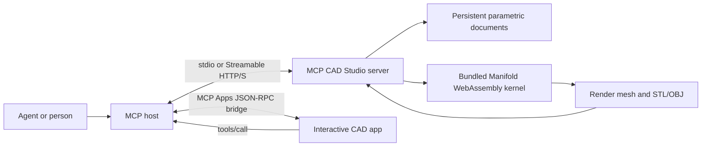

# MCP CAD Studio

A self-contained parametric CAD workspace delivered as an MCP server and an
interactive [MCP App](https://modelcontextprotocol.io/docs/extensions/apps).
Agents can create and edit models through tools; people can work on the same
models in a live 3D studio rendered inside any compatible host.

## What it does

- Renders a full 3D editor through the `studio_ui` tool.
- Creates boxes, spheres, cylinders, cones, polygon extrusions, imported meshes,
  transforms, and nested union/difference/intersection trees.
- Generates editable brackets, pipes, gears, enclosures, and bolts.
- Loads, patches, regenerates, and deletes persistent model documents with
  optimistic revision checks.
- Preflights extrusion outlines and raw meshes with actionable topology
  diagnostics before they reach the CAD kernel.
- Imports ASCII/binary STL and OBJ; exports ASCII STL and OBJ.
- Keeps an open app synchronized with model-initiated MCP tool calls.
- Runs over stdio or Streamable HTTP, with direct HTTPS support.
- Uses a bundled WebAssembly CAD kernel—no OpenSCAD, Python, compiler, Docker,
  or native CAD installation is needed.

The server's data tools are UI-independent. A client that cannot render MCP Apps
can still perform every CAD operation and receive structured model/mesh data.

## Install

Node.js 20 or later is the only runtime requirement. The CAD engine and all
JavaScript dependencies install with the package.

Run directly from GitHub:

```bash
npx -y github:flujo-app/mcp-cad-studio --stdio
```

Or clone and build:

```bash
git clone https://github.com/flujo-app/mcp-cad-studio.git
cd mcp-cad-studio
npm install
npm run build
npm start -- --stdio
```

### MCP client configuration (stdio)

```json
{
  "mcpServers": {
    "cad-studio": {
      "command": "npx",
      "args": ["-y", "github:flujo-app/mcp-cad-studio", "--stdio"]
    }
  }
}
```

Models persist by default to `~/.mcp-cad-studio/models.json`. Use
`--data-file <path>` to choose another file or `--no-persist` for an in-memory
session.

## HTTPS / Streamable HTTP

Run a local HTTPS endpoint with a generated self-signed certificate:

```bash
mcp-cad-studio --transport https --host 127.0.0.1 --port 8787
```

For a remotely reachable production server, use a trusted certificate:

```bash
mcp-cad-studio --transport https \
  --host 0.0.0.0 \
  --port 8787 \
  --tls-cert /run/secrets/fullchain.pem \
  --tls-key /run/secrets/privkey.pem
```

The MCP endpoint is `/mcp`; a read-only health endpoint is available at
`/health`. TLS termination at a reverse proxy is also supported—run with
`--transport http` behind the proxy.

## MCP tools

| Tool | Purpose |
| --- | --- |
| `studio_ui` | Open the interactive MCP App and optionally select a model |
| `list_models` | List saved models and revisions |
| `load_model` | Load the parametric document and its render mesh |
| `create_model` | Create a model from a declarative shape tree |
| `generate_model` | Create a template model, or regenerate one in place by `modelId` |
| `update_model` | Patch or replace a model's definition, name, or color in place |
| `validate_shape` | Preflight a shape without saving it |
| `transform_model` | Apply an incremental translation, rotation, or scale |
| `boolean_models` | Union, subtract, or intersect saved models into a new model |
| `duplicate_model` | Make an editable copy |
| `delete_model` | Permanently delete a model |
| `import_model` | Import STL/OBJ text or base64 data |
| `export_model` | Export ASCII STL/OBJ data |

All mutating results include `models`, `activeModel`, and `mesh` in
`structuredContent`, so the UI and model see the same canonical state. Model
creation is reserved for genuinely separate models. For revisions, first call
`load_model`, then pass its `modelId` and `revision` back as
`expectedRevision` to `update_model`, `generate_model`, or `delete_model`.

### Updating without creating copies

`update_model` preserves the model ID and supports either a complete replacement
`shape` or small RFC 6901 JSON-Pointer-style patches. This changes the X size of
a saved box without resending its whole definition:

```json
{
  "modelId": "5e44fd24-b7df-450a-a7bb-31c95496832f",
  "expectedRevision": 3,
  "patches": [
    { "op": "replace", "path": "/shape/size/0", "value": 80 }
  ]
}
```

Patches can target `/shape`, `/name`, or `/color` and are applied in order.
`add`, `replace`, and `remove` are supported. The completed definition is
schema-checked and geometry-checked before the saved model is changed.

For template-level edits, such as changing a gear's tooth count, call
`generate_model` with the existing `modelId` and `expectedRevision`. The
template is regenerated into the same document instead of creating another
model.

## Parametric model format

`create_model` and `update_model` accept a recursive shape tree. For example, a
plate with a cylindrical hole:

```json
{
  "name": "Mounting plate",
  "color": "#60a5fa",
  "shape": {
    "kind": "difference",
    "children": [
      { "kind": "box", "size": [80, 50, 6], "center": true },
      {
        "kind": "cylinder",
        "height": 8,
        "radius": 5,
        "segments": 48,
        "center": true
      }
    ]
  }
}
```

Every node can include a transform:

```json
{
  "transform": {
    "translation": [10, 0, 4],
    "rotation": [0, 0, 45],
    "scale": [1, 1, 1]
  }
}
```

Rotations use degrees. Dimensions are unit-agnostic in the kernel; the studio
labels them as millimeters.

Shape objects are strict: misspelled or unsupported fields produce an error
instead of being silently ignored. `validate_shape` checks a draft without
saving and reports JSON paths, error codes, and suggested repairs. Checks
include:

- repeated, zero-length, zero-area, and self-intersecting extrusion outlines;
- incomplete or out-of-range mesh arrays and degenerate triangles;
- open boundaries, edges shared by too many faces, inconsistent winding, and
  disconnected surface fans at a vertex;
- shape-tree and twisted-extrusion complexity limits;
- final verification by the Manifold CAD kernel.

If the kernel still rejects a shape, its status is translated into guidance for
non-finite vertices, non-manifold geometry, invalid construction, oversized
results, and the other kernel status classes.

## Architecture



The `studio_ui` tool links to `ui://cad-studio/studio.html` with
`_meta.ui.resourceUri`. The component uses the stable MCP Apps bridge
(`ui/initialize`, `ui/notifications/*`, and `tools/call`) rather than requiring
host-specific globals. Model polling is revision-aware, making external tool
edits visible in an already-open editor.

## Development

```bash
npm install
npm run check
```

`npm run check` performs strict TypeScript checking, 16 kernel/store/protocol/
transport tests, and a production build. The test suite uses the real
WebAssembly geometry engine and both in-memory and Streamable HTTP MCP clients.

Useful commands:

```bash
npm run dev       # HTTP development server on port 8787
npm test          # Vitest suite
npm run typecheck # TypeScript only
npm run build     # bundle the MCP App and server
npm pack          # verify the single-package artifact
```

To publish the current version to npm:

```bash
npm run release
```

The release command signs in through npm when necessary, runs the complete
check suite, publishes the package publicly, and confirms that npm serves the
version. It is safe to rerun: if that exact version is already published, it
verifies the project and skips the duplicate publish.

Run `npm run release:check` to validate the release helper without publishing.

## Security notes

- Tool schemas cap shape depth, node count, mesh size, and imported file size.
- Mutation tools accurately declare read-only/destructive/open-world hints.
- `expectedRevision` prevents accidental overwrites and stale deletion during
  concurrent editing.
- Patch paths are restricted to editable model fields and reject prototype
  traversal.
- The app resource declares an empty external-resource/connect CSP.
- A generated self-signed certificate is intended for local development only.
- Authentication is deployment-specific. Put remote multi-user instances behind
  an authenticated gateway and enforce per-user authorization there.

## License

MIT
